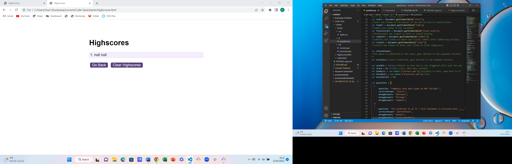

# Code-Quiz
Week 6 Challenge

Further practice with JavaScript
## Description
I wanted to create a coding quiz that would ask a series of multiple choice questions.
This work would enable me to learn more use of JavaScript, especially functions, the use of addEventListener, buttons, timers, and local storage.
I wanted to deploy my finished product and check it had no errors.
I wanted to practise writing an appropriate README.md.

## Installation
n/a

## Usage

When the website is viewed, the user is asked to start the quiz.
The user is taken through 5 multiple choice questions to complete in 75 seconds. When a question is answered wrongly, the clock runs down by 10 seconds.
At the end of the quiz, the user is asked to enter their initials.
Initials and scores are displayed on another, linked, webpage, and stored unless and until cleared by the user.

Site is published at https://philculling.github.io/Code-Quiz

Screenshot:

## Credits
Some help was provided by BCS tutoring.

## License
Please refer to the LICENSE in the repo.